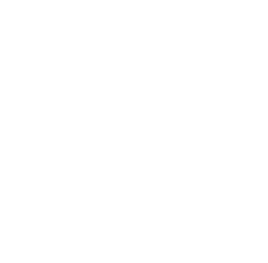

<h1 style=" font-size: 2rem; font-weight: bold; z-index: 2; margin: 0;">John Patrick Salen</h1>

<h2 style="font-size: 1.2rem;">
Junior Web Developer
</h2>
<a href="https://johnpatricksalen.tech" style="font-size: 1rem; color: red; text-decoration: none; padding: .5rem 1rem; background-color: #36384a; border-radius: .8rem; width: max-content;">Portfolio</a>

